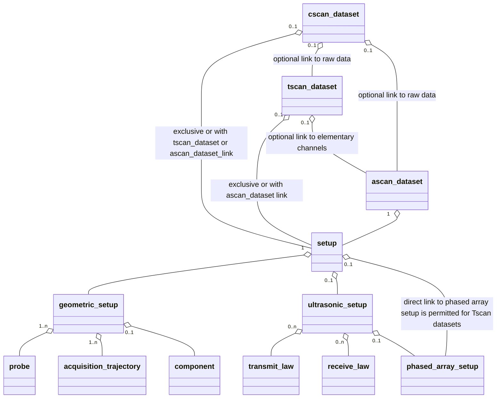

```mermaid
classDiagram
  ascan_dataset "1" o--  setup 
  tscan_dataset "0..1" o-- setup : exclusive or with ascan_dataset link
  cscan_dataset "0..1" o-- setup : exclusive or with tscan_dataset or ascan_dataset_link
  cscan_dataset "0..1" o-- tscan_dataset : optional link to raw data
  cscan_dataset "0..1" o-- ascan_dataset : optional link to raw data
  tscan_dataset "0..1" o-- ascan_dataset : optional link to elementary channels
  setup "1" o-- geometric_setup
  setup "0..1" o-- ultrasonic_setup
  setup "0..1" o-- phased_array_setup : direct link to phased array setup is permitted for Tscan datasets
  ultrasonic_setup "0..n" o-- transmit_law
  ultrasonic_setup "0..n" o-- receive_law
  ultrasonic_setup "0..1" o-- phased_array_setup
  geometric_setup "1..n" o-- probe
  geometric_setup "1..n" o-- acquisition_trajectory
  geometric_setup  "0..1" o-- component
```
