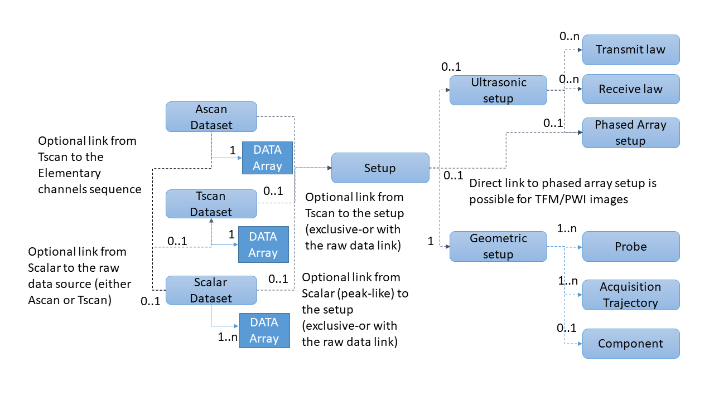
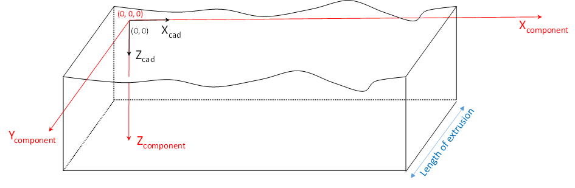
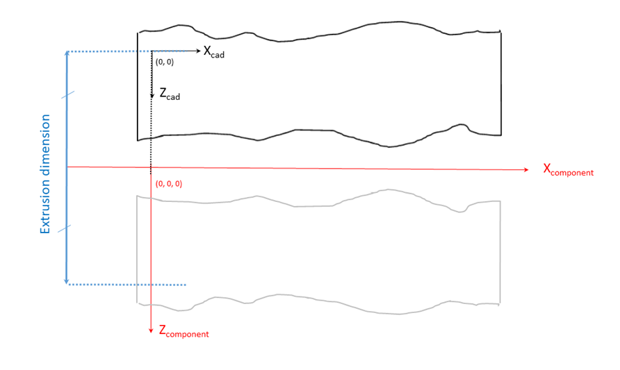
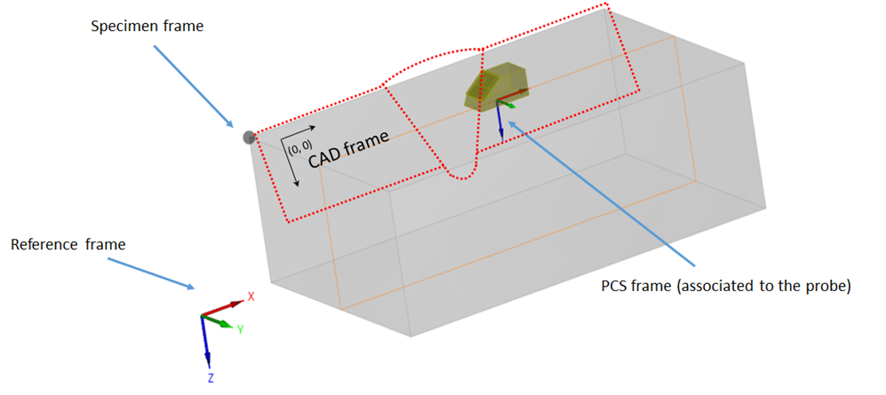

# Open NDE File Format specification - Version 0.3

# Generalities

## Preamble

  The ONDE (**Open Non Destructive Evaluation**) format results from a joint intiative by COFREND and EPRI to define a specification of open and efficient NDE
  format in order to facilitate interoperability between softwares and to ensure ability to read the data in the long term. 
  This document is therefore a technical proposal to facilitate the establishment of a neutral and open format that can
  be a good candidate for a wide standardization effort.

  The objective that was assigned to this file format is to store ultrasonic raw data to be
  able to:

  * (re)analyse it, including ultrasonic metadata required for report generation, or
  * (re)use it for further data processing, or
  * achieve interoperability between acquisition systems and analysis software.

  The objective is neither to be able to (re)produce an acquisition setup nor to (re)create a
  simulation configuration from the ultrasonic data file alone. We define as raw data the data which is produced by
  the acquisition system (AScans, TFM images, ...).

  At this stage, it was decided to stick to the data acquired and the information that is necessary to
  perform an analysis. With a few exceptions, we did not add the information that is related to the analysis procedure
  itself (information related to the display, palette, etc...). This will be addressed in future stages (information
  related to analysis, reporting, ...).

- The Working Group has analysed several existing contributions as a working basis to define an open and standardized
  file format for ultrasonic testing. Formats coming from organisations (ECUF, MFMC, DICONDE, ANDE) and commercial products (
  EVIDENT, TPAC, EDDYFI, SONATEST, CIVA) have been studied.\
  It was decided that the format would be based on the HDF5 framework, chosen for its well-established software
  ecosystem and its efficiency. The format proposal makes technical choices akin to those of the MFMC and ECUF format,
  and extends their possibilities in order to accommodate for a larger range of specimen geometries and types of data
  that are commonly encountered and were absent of the MFMC and ECUF specifications. In order to facilitate the migration
  from MFMC to ONDE, a compatibility with MFMC 2.0 specification has been added to the present specification.

- The format aims at finding the best compromise between two approaches : a very generic one with
  essentially raw geometric descriptions and a NDT oriented one with a representation of the objects familiar to the
  engineers. Considering that the transformation from NDT objects to the generic representation was straightforward, it
  was decided to systematically keep the generic representation and to allow to complement this representation with
  optional fields describing the objects in order to facilitate advanced analysis and visualisation. This approach was
  essentially adopted for three objects, namely the probe, the
  trajectory and the setup of the electronic laws.

- From an HDF5 structure perspective, architecture (flat or hierarchical) is not imposed. The relations between hdf5
  groups are translated into HDF5 references. The location of the HDF5 groups in the file is left open to the discretion of the implementor.
  The names of the groups is not imposed, the semantics of the group being defined by the mandatory TYPE attribute. 
  Only TYPE and VERSION at hdf5 root level have a location that is  imposed in the file. 
  In order to allow the proposed file format to coexist with other hdf5 file formats, the raw data (
  arrays of signals or array of images which typically represents the vast majority of the file weight) can be anywhere
  in the file structure.

- All quantities are defined with SI units. Units are therefore expressed in meters, kilograms,
  seconds. However, degrees are used instead of radians.

## Tables legend

In the following sections, the data structure is described by blocks presented in tables.

Hereafter, when pointing to ECUF and MFMC, we refer to MFMC specification document 2.0.0b[^1] and ECUF 1.0[^2].

**Variables used in structure definition:**

Definitions (derived from MFMC 2.0.0b specification)

- Ultrasonic Element -- an ultrasonic transduction device that can be excited through an electric signal externally
  driven and/or that can reversely convert ultrasound into a signal
- Ultrasonic Probe -- a collection of ultrasonic elements that are assembled together so that their relative positions
  and orientations are fixed during the acquisition process -- note that probes that possess the ability to adapt to the
  surface during the acquisition are not handled in this version of the specification
- Specimen -- object which is the subject of the inspection
- Frame -- position and orientation of a given object related to an acquisition
- Probe Element Combination (PEC) -- the system used within an MFMC structure to identify a specific element in a
  specific probe, comprising an HDF5 reference to the probe group and the index of an element in that probe;
- Focal law -- a set of instructions that specify how one or more PECs are used together;
- Transmit focal law -- a focal law relating to transmission of ultrasound from one or more PECs;
- Receive focal law -- a focal law relating to reception of ultrasound from one or more PECs;
- A-Scan -- a time-domain, ultrasonic signal (comprising amplitude measurements regularly sampled in time at a specified
  sampling frequency) that is recorded for a combination of transmit focal law and receive focal law; this can be used
  to represent both summed signals and elementary channels
- DataFrame -- a collection of coherent data obtained for a particular triggering event consisting of one of the
  following:
    - A-scans obtained using different transmit and receive focal laws for each A-scan;
    - Reconstructed images corresponding to specific reconstruction zones
    - Scalar data (peak-related or corresponding to particular post-treatments)
- Dataset -- a collection of dataframes in which all acquisition parameters are fixed from one dataframe to another;
- Ultrasonic time -- timescale over which an individual ultrasonic A-scan is recorded, which is assumed to be
  instantaneous compared to timescale associated with mechanical movement of probes;
- Propagation line -- string of connected segments representing the ultrasonic propagation for a given focal law;
- Trajectory -- set of frames representing the different position of a device;
- Acquisition grid -- particular trajectory corresponding to a cartesian grid located at the surface of a plane or
  cylindrical component;
- Image zone -- 2D or 3D regular cartesian grid used to define the reconstruction points creating the images during a
  TFM or PWI-like acquisition;

| **Variable**  | **Description**                                                          |
|---------------|--------------------------------------------------------------------------|
| N_Probes      | Number of probes                                                         |
| N_Dataset     | Number of datasets                                                       |
| N_Elem\<p\>   | Number of elements of p-th probe                                         |
| N_DF\<m\>     | Number of dataframes in m-th dataset                                     |
| N_Time\<m\>   | Number of time-points per A-Scan in m-th dataset                         |
| N_Ascan\<m\>  | Number of A-Scans per dataframe in m-th dataset                          |
| N_Prob\<m\>   | Number of probes used in m-th dataset                                    |
| N_Law\<m\>    | Number of focal laws associated with each dataframe in the m-th dataset  |
| N_Comb\<k\>   | Number of probe/element combinations used in k-th focal law              |
| N_Points\<k\> | Number of points used to describe the k-th focal law propagation_line    |
| N_TSig\<m\>   | Number of time-points in the emission signal in the m-th dataset         |
| N_COL\<m\>    | Number of columns in the image zone for a Tscan in the m-th dataset      |
| N_ROW\<m\>    | Number of rows in the image zone for a Tscan in the m-th dataset         |
| N_PLANE\<m\>  | Number of planes in the image zone for a 3D Tscan in the m-th dataset    |
| N_U\<m\>      | Number of acquisition positions in the U direction for the m-th dataset  |
| N_V\<m\>      | Number of acquisition positions in the V direction for the m-th dataset  |

Note : if N_U and N_V are defined (grid-like acquisition), N_DF\<m\> = N_U\<m\> x N_V\<m\>Data Model

The data model of an ONDE file is described through fields that are grouped by blocks, each block corresponding to a NDE
concept.

*Figure 1: Relationships between the different blocks in the data model*

The diagram in Figure 1 explains the relationships between the different blocks in the data mdoel. The arrows signify
that a block contains links towards other blocks. The number of possible blocks / links in the file is given with
minimum and maximum values separated by two dots as is common in UML description.

Three blocks type contain the data : namely, Ascan, Tscan and CScan (peak-like) blocks. Ascans can be used either to
describe summed signals or elementary channels data. For Cscan block, it is possible to keep the track to the raw data (
either Tscan or Ascan) from which the Cscan data originates. For Tscan blocks, it is possible to keep the track to the
elementary channels. A link to the setup can be specified : it is attached to the raw data if it is available, to the
post-processed data (Cscan or Tscan) otherwise.

The setup description is organized in two blocks defining the ultrasonic setup and the geometric setup. In the
ultrasonic setup we find the description of the electronic settings, with blocks describing the emitter and receive laws
and the phased array setup for acquisition with multielement transducers.

The geometric setup contains the dynamic description of the scene : inspected component, probes and acquisition
trajectories. It is possible to define different trajectories for different probes or to have probes sharing the same
trajectory, offsets retrieving the set of different probe positions from the trajectory.

## HDF5 implementation

### Entry points

The blocks defined in the general structure are implemented as HDF5 groups, the name of which is free but which have a
mandatory 'TYPE' attribute that defines their nature. The entry points are the xxx_DATASET groups (namely groups that have as a TYPE attribute
 ASCAN_DATASET, TSCAN_DATASET or CSCAN_DATASET) 

When discovering the content of a given file, the following procedure must therefore be applied :

- Read the 'TYPE' and 'VERSION' attributes at root level and verify the compatibility of the version number with the
  reader, and that the type is that of a UT ONDE file ('ONDE_UT')
- Read all groups in the file and identify the groups corresponding to the datasets blocks by checking
  which groups have a 'TYPE' attribute whose value is 'ASCAN_DATASET', 'TSCAN_DATASET', 'CSCAN_DATASET'.
- From there follow the HDF5 references defined in the specification to retrieve the data arrays, the related datasets, the
  setup information, ...

### Rules for the HDF5 groups

The HDF5 implementation of the format follows the following rules :

- The extension of the HDF5 file is ".onde" (for Open Non Destructive Evaluation format)
- The block structure defined above is implemented with HDF5 groups. The name of the group is left at the discretion of
  the user. It is the mandatory TYPE attribute that defines the group type (SPECIMEN, PROBE, ACQUISITION_TRAJECTORY,
  etc...).
- Links to other HDF5 groups are specific fields stored as HDF5 references or arrays of references.
- The following data types will be stored as attributes
    - Integers
    - Floating points
    - Strings
    - Vectors of dimension 2 or 3
- The following data types will be stored as datasets
    - Int arrays
    - Float arrays
- HDF5 polymorphism mechanism is used, so that the data can be stored with arbitrary precision (for instance, integers
  can be stored as INT16, INT32 or any user-defined integer length). The range of accessible data is implicitly defined
  by the HDF5 type. In the document, INT and FLOAT refer to this polymorphism. For instance, in the tables, an INT array
  should be interpreted as array pointing to any HDF5 integer type.
- The tables below specify the cardinality of the different HDF5 objects. For some of the table entries, we have given
  the liberty to specify one float instead of a complete vector. In this case, the same value implicitly applies to all
  elements of the vector. For example, it is allowed to provide a vector of size 1 for the frequency, instead of
  specifying the same frequency for all elements.
- For arrays (which are stored as HDF5 datasets), the tables give the dimensions of the array in row-major order (the
  last dimension corresponds to contiguous data in the file). Compression of arrays through the native compression schemes of the HDF5 libary
  (gzip3, Szip).

## Definition of frames

### 3D Frames

Figure 2 displays the different frames and convention involved in the positioning systems. The PCF (Probe Coordinate
Frame) is the frame that is related to a specific probe or set of probes. It can be arbitrarily chosen to be centered
along the piezoelectric cell, the index point, the carrier system, the Probe Center Separation for TOFD systems, etc...
Through a rigid-body offset, it is related to the Trajectory Frame (TF), which for a given position is defined in
relation to the Reference Frame. The list of these positions are defined in an Acquisition Trajectory block.

The components frames are defined in the Reference Frame.

*Figure 2: Different frames and convention involved in the positioning systems*

In the document, it was chosen to define the transformation between two frames in the shape of a vector consisting of 7
values: 3 for the offset in terms of x,y,z directions, 4 for the rotation defining the frame expressed in terms of
quaternions. The definition of rotations through quaternions was chosen because of its compactness and the absence of
ambiguity (as opposed to Euler angles which require defining an ordering of the directions).

The Wikipedia pages related to quaternion and rotation matrices provide formulae for the transition from the quaternion
shape to rotation matrices and the reverse operation: <https://en.wikipedia.org/wiki/Rotation_matrix#Quaternion>.

Throughout the document, a frame is provided for the following objects :

- The specimen frame,
- The trajectory frames (a frame for each position in the trajectory)
- The probe coordinate frames
- The elements
- The TFM Zones
- The index points

The diagram displayed in Figure 3 defines the hierarchy between these frames:

*Figure 3: Hierarchy of the frames used for the geometric representation of the objects*

### 2D Frames

In order to refer to frames on unfolded 2D surfaces, we introduce the following transformation : the transformation
between frame (O,u,v) and (O',u',v') is expressed in the (O,a,b) frame by the (∆a,∆b,α) triplet.

*Figure 4: Definition of the (∆a,∆b,α) triplet defining transformation between two 2D frames*

# Data structure

## Description of the format

The specification of the format is provided in a [dedicated csv file](../ONDE_fields/ONDE_fields.csv) organized in the following manner :

- The first column gives the field label and its location in the structure. The following convention applies : the name
  in bracket points to a group corresponding to a block of the data model. For example, {ascan_dataset} indicates an
  HDF5 group corresponding to an Ascan dataset.
- The second column contains comments explaining the constraints imposed on the datafield
- The third column gives a Mandatory/Optional status
- The fourth column gives the HDF5 implementation : D stands for dataset while A points to an information stored as an
  attribute.
- The fifth column gives the HDF5 type
- The sixth column gives the number of dimensions
- The seventh column provides information on the size or the content of the datafield. For a string with a value that is
  imposed, it will provide this value.\
  For other datafields, it will be the size of the data. The size is provided in brackets with dimensions separated by
  commas. The dimension of a scalar data will therefore be described by [^1]. Dimensions are provided in C
  convention (row-major ordering).

## MFMC Compatibility

ONDE has been inspired by some principles of the MFMC specification and can be seen in many ways as an extension
of the MFMC file format.

To facilitate the transition for the organizations having already implemented reading/writing in the MFMC
format, mechanisms have been provided to manage MFMC files while benefiting from the extra scope provided in the ONDE
specification. These fields are identified in the comments of the [csv file](../ONDE_fields/ONDE_fields.csv) providing the data structure.

## Explanatory notes

### Version

The file is identified as a UT ONDE file because of the TYPE datafield which is given at the root of the structure. The
version of the file points to the version of the present specification.

### Generic remarks on datasets

The DATE_AND_TIME and OPERATOR fields allow to give indication on the context of the acquisition. For DATE_AND_TIME the
ISO 8601 extended format: 'yyyy-mm-dd HH:MM:SS' (e.g. '2019-01-16 17:05:06') must be used.

### Ascan datasets

Ascan datasets are the entry points for the description of data that is stored as time signals. The MFMC equivalent is '
SEQUENCE', and both names are allowed to ensure compatibility.

To allow continuity with existing HDF5 formats, the DATA field can be either a HDF5 dataset or a reference to a
dataset located in another part of the HDF5 structure.

### Tscan datasets

**General**

Even though the name (Tscans coming from TFM Scans) implicitly refers to the TFM reconstruction images, the block can
apply to any reconstruction method producing data on a rectangular/parallelepiped grid that moves with the sensor (be it
obtained by TFM, Adaptive TFM, PWI, Adaptive PWI, frequency reconstruction, or any variant of these methods)

**3D Zones**

The format allows for the description of 3D zones. Taking into account the dimension related to positions, this implies
that the dimension of the data array depends on the zone dimension (3D array for 2D zones 4D array for 3D zones),

**Zone dimension and position**

The zone physical dimension is given by the ZONE_DIMENSION field, (DX,DY,DZ) being the physical dimensions of the zone,
a zero or a NaN for one of the dimension implies a 2D zone.

ZONE_SIZE is a triplet which gives the number of pixels of the zone for each dimension (NX,NY,NZ).

The zone position is given by ZONE_FRAME and is expressed relatively to the trajectory frame pointed to by
REFERENCE_TRAJECTORY.

*Figure 5: Example of TFM zone positioning*

In the example displayed in Figure 5, the trajectory frame is located at the index point and the zone is positioned
accordingly.

**Pixel ordering**

The pixels are stored in the (X,Y,Z) order (X being the outer loop, Z the inner loop in the array)

### CScan datasets

**CScan data and peaks**

While this Cscan dataset is mostly meant for the storage of peak-like data (amplitude, time of flight, etc...) it is
more generic and can accommodate different values.

DATA contains a vector of references to datasets containing scalar raw data. The size of the data can be either
N_DF\<m\> x N_Ascan\<m\> arrays (for data resulting from analysis of signals or N_DF\<m\> arrays for encoder data or
data
resulting from Tscan or monoelement scans.

**Data description**

The DATATYPE field contains a name defining the nature of the data- the name can be either custom (MY_MATERIAL_PROPERTY
for instance) or a standardized name: THICKNESS, TIME_OF_FLIGHT, DEPTH, AMAX.

**Data numbering**

To be efficient for relatively small amounts of data, as opposed to other blocks, the Cscan block allows for
the handling of several data inside the block. The DATA, DATA_TYPE vectors must have the same length and be ordered
coherently.

**Data positioning**

The Cscan data can be positioned through a trajectory block which is defined in REFERENCE_TRAJECTORY.

**Underlying raw data**

UNDERLYING_DATA is used to point to the dataset that corresponds to the originating raw data. LINKED_DATASET_REFERENCE
gives the correspondence between the scalar data and the originating scan. For a A-Scan, the correspondence to the scan
is expressed in terms of (dataframe, law). For a 2D Tscan, it will be (dataframe, column), for a 3D Tscan, it will be (
dataframe, plane, column).

**Gates**

The gates used for the acquisition are defined through three parameters.\
GATE_START and GATE_WIDTH define the time window and GATE_THRESHOLD defines the threshold that was used to trigger the
storage of the data.

### Setup

**Setup**

This group contains references to the geometric setup and ultrasonic setup. The reference to the ultrasonic setup is
compulsory for the A-scan data. For TScans, it is allowed to bypass this ultrasonic setup and have a direct reference to
the phased array setup (in order to store the reconstruction information without storing the information related to the
acquisition).

### Geometric setup

**Description**

The geometric setup contains references to the inspected component, the probes and the trajectory. If the specimen
description is missing, a semi-infinite half-plane is assumed, with interface at z=0 and material for z>0.

**Trajectories**

ACQUISITION_TRAJECTORY gives references to the groups describing the trajectory -- references have the same order as
PROBE_LIST. PROBE_COORDINATE_FRAME can be used to define an offset between a referenced trajectory and the probe -
identity is assumed if not provided.

### Component

**Velocities**

The two values of the VELOCITIES array indicate the inspected component longitudinal and shear wave velocity
respectively. If both velocities (Longitudinal and Shear) are not available, the missing one should be replaced by a
NaN).

This version of the format handles only isotropic materials.

**Shape and dimensions**

SHAPE defines the geometric shape of the inspected component as one of the following: "PLATE","CYLINDER",
"EXTRUSION_CAD", "3D_CAD". While the format is quite generic by handling CAD files, parametric description is only
available for plane and cylindrical specimens. Other parameterized shapes can be added in future versions.

For plane components, the dimensions are give by PLATE_DIMENSIONS, with a triplet for length, width and height.

For cylindrical components, the dimensions are given by CYLINDER_DIMENSIONS, with a triplet for outer diameter,
thickness, and length.

For 2D extruded components, extrusion is provided by EXTRUSION_TYPE (plane or sylindrical) and EXTRUSION_DIMENSION for
the length for plane extrusion, the diameter for cylindrical ones.

The CAD field can contain a STEP or STL file for 3D CADs, a dxf file for 2D CADs.

**Visualisation CAD**

VISUALISATION_CAD contains a DXF or STL file for the component visualization. When using a dxf file, the profile will be
extruded linearly or cylindrically according to the component type.

**Transformations**

The global coordinate system is distinct from the specimen coordinate system : for example, 2D and 3D CAD coordinates
are defined in the specimen frame and repositioned in the global coordinate system with the transformation defined in
COMPONENT_FRAME ([see paragraph 1.6](#definition-of-frames)).

**Conventions for planar specimens**

In the planar coordinate system, the z direction is defined as the one corresponding to the thickness of the inspected
specimen (see Figure 6). The dimensions are given by PLATE_DIMENSIONS, as a triplet with values for length, width, and
thickness.

*Figure 6: Trajectory planar coordinate system convention*

**Conventions for cylindrical components**

In the cylindrical coordinate system, the x direction is the one corresponding to the cylinder axis (see Figure 7). The
dimensions are given by CYLINDER_DIMENSIONS, with a triplet for outer diameter, thickness, and length .

*Figure 7: Trajectory cylindrical coordinate system convention*

**Conventions for 2D CAD components**

The dxf file gives, in the (X, Z) frame, the 2D CAD description of the component, either for a planar or a cylindrical
extrusion. For 2D extruded components, extrusion is provided by EXTRUSION_TYPE (plane or sylindrical) and
EXTRUSION_DIMENSION for the length for plane extrusion, the diameter for cylindrical ones.

The CAD field contains a dxf file for 2D CADs.

For 2D CAD specimen with planar extrusion, the origin is implicitly defined as the (0,0) point in the 2D CAD sketch (see
Figure 8).

*Figure 8: Convention for the description of a 2D CAD component with planar extrusion*

For 2D CAD specimen with cylinder extrusion, the rotation is performed along the X axis of the DXF schema and the 3D
origin corresponds to the projection on this axis of the 2D CAD sketch origin (see Figure 9)

*Figure 9: Convention for the description of a 2D CAD component with cylinder extrusion*

**Visualization CAD**

When a dxf is provided for the Visualization CAD, the extrusion of the CAD is implied from the specimen shape : it is of
linear nature if the specimen is a plate or a 2D CAD with linear extrusion, it is cylindrical if the specimen is a
cylinder or a 2D CAD with cylindrical extrusion. A typical use case for this feature is the ability to superimpose a
weld profile to a plate or cylindrical specimen in order to facilitate the interpretation of the indications.

The CAD profiles that are used for visualization are expressed in the (X,Z) plane as specified in the specimen frame.
Figure 10 illustrates the CAD frame positioning to the component frame for a planar component.

*Figure 10: Convention for the positioning of the visualization CAD in a planar component*

Figure 11 illustrates the CAD frame positioning according to the component frame for a cylinder specimen. The outer
diameter corresponds to the distance between the top left hand corner of the dxf profile and the origin of the component
frame.

*Figure 11: Convention for the positioning of the visualization CAD in a cylindrical component*

### Probes

**Probe representation**

The probe block of the data model accommodates two distinct levels of representation: a very generic one that describes
the exact positions and shapes of the elements forming the transducer and another one that more closely follows ordinary
technical specifications of the transducer in terms of transducer dimension, pitch, shape, wedge dimensions, etc...

As indicated in the preamble, as for other matters, we have imposed the generic representations and provide optionally
the possibility to have a more NDE-oriented description.

**Dual probes**

In the file format, when using the NDE-oriented description, dual probes are handled as one PROBE block. When using only
the generic description, the freedom to define one or two blocks remains, as in MFMC and ECUF formats.

**Frequencies**

In order to accommodate for advanced setups, we have chosen to give the possibility to define one frequency per element.
A common usage will however be to have one frequency for all elements, and in this case, it is possible to define an
array of size one with the frequency applied to all elements. The same possibility to provide one value applied to all
elements is also provided for other fields related to elements except ELEMENT_POSITION. The cardinality can thus either
be 1 or N.

**Element shapes**

The geometry of the elements is defined by the ELEMENT_SHAPE field. The shape of each element will be defined as one of
the following: rectangle (ELE_GEOM_REC), part of a ring (ELE_GEOM_RING_PART), part of an elliptical ring
(ELE_GEOM_ELLIPSE_PART).

The size is provided through 6 parameters in ELEMENT_SIZE. These 6 parameters indicate the dimensions of each element
according to their geometry, see Figure 12.

For ELE_GEOM_REC : DIM_X1, DIM_Y, 0.0, 0.0, 0.0, 0.0.

For ELE_GEOM_RING_PART: r, e, theta_min, theta_max, 0.0, 0.0

For ELE_GEOM_ELLIPSE_PART: r_X, e_X, r_Y, e_Y, theta_min, theta_max

*Figure 12: Different types of element shape*

**Element positioning**

The ELEMENT_FRAME array defines the position and orientation of the probe elements defined by their frames in the PCF.
For rectangular elements, x and y must be aligned with the main axes of the rectangle. For elliptical elements, x and y
must be aligned with the major and the minor axes of the ellipse. For circular rings, x and y simply must be coplanar
with the element. The frame should be orientated such that z is in the direction of ultrasonic emission (See ).

**Element ordering convention**

For linear and matrix probes (see Figure 13), the chosen convention is as follows : numbering according to the minor
axis then according to the major axis, both in ascending order.

For annular, elliptical and bi-elliptical probes (see Figure 13), the chosen convention is as follows : numbering from
internal rings to external rings. On each ring, the numbering is done in ascending order in the direct direction around
the Z axis of the probe, the origin being taken on the major axis.

For dual probes (see Figure 14), the two probes have a symmetrical cutout. The right probe has elements from 1 to N
following the numbering convention established previously. The left probe has elements from N+1 to 2N with a numbering
symmetrical to that of the right probe according to the major axis.

*Figure 13: Convention for element numbering*

*Figure 14: Convention for dual probes element numbering*

**Wedge angles conventions**

For contact probes, wedge angles are defined according to this order of application (see Figure 15):

1. rotation of the incidence angle around the Y axis of the probe in the direct direction

2. rotation of the skew angle around the new X axis of the probe in the direct direction

3. rotation of the disorientation angle around the new Z axis in the direct direction

For dual probes, wedge angles are defined according to this order of application (see Figure 15):

1. rotation of the incidence angle around the Y axis of each probe in the direct direction

2. rotation of the roof angle around the new X axis of each probe in the direct direction

3. rotation of the disorientation angle around the new Z axis of each probe in the direct direction

4. rotation of the squint angle around the new Z axis of each probe
    - in the direct direction for the right probe
    - in the indirect direction for the left probe.

*Figure 15: Definition of wedge parameters for contact and dual probes*

The definition of the index point for contact probes with planar and cylindrical wedges along the major and minor axis
are given in Figure 16, Figure 17, Figure 18 respectively.

*Figure 16: Definition of wedge parameters for contact planar probe*

*Figure 17: Definition of wedge parameters for CYLINDRICAL_MAJOR contact probe*

*Figure 18: Definition of wedge parameters for CYLINDRICAL_MINOR contact probe*

The definition of the index point for dual probes with planar and cylindrical wedges along the major and minor axis are
given in Figure 19, Figure 20 and Figure 21 respectively.

*Figure 19: Definition of wedge parameters for a dual planar probe*

*Figure 20: Definition of wedge parameters for CYLINDRICAL_MAJOR dual probe*

*Figure 21: Definition of wedge parameters for CYLINDRICAL_MINOR dual probe*

**Surrounded and surrounding probes**

These can be defined by using the cylindrical FOCALISATION_SURFACE. A positive radius will be used for surrounding
probes, a negative one for surrounded probes.

**Velocities**

As for specimens, if both velocities (Longitudinal and shear) are not available, the missing one should be replaced by a
NaN).

### Acquisition trajectory

**Time encoding**

For acquisition having no spatial encoding, the format allows to describe time encoding. This is achieved by setting the
TRAJECTORY_TYPE field. In the case of time encoding, the ACQUISITION_RATE must be specified.

**Frame used for trajectory definition**

The trajectory is given in the global reference frame.

**Generic description**

A generic description of the trajectory is given in the TRAJECTORY field. It describes successive positions under the
shape of frames, each giving a position and an orientation.

**Grid trajectory**

In order to facilitate the interpretation of trajectories for common cases for which the acquisition grid (1D or 2D) is
defined, the specification allows to complement the generic TRAJECTORY field (which is mandatory) with grid data. The
component must be a plane or a cylinder.

At this stage, the specification does not cover the possibility to describe cylindrical or plane grid trajectories on
CAD specimens, this will be addressed in future versions.

**Grid origin**

The origin and the orientation of the grid (Dx,Dy,alpha) are provided in (x,y) coordinates in the case of a plane specimen, in (x,
theta) coordinates in the case of a cylinder specimen, theta being the radial direction on the unfolded surface. They are expressed as a 2D transform from the surface component
frame in UV_GRID_FRAME. For cylindrical components, it is necessary to specify if the inner or the outer surface is
concerned, which is achieved by setting GRID_CYLINDER_DEFINITION to INNER or OUTER.

This surface component frame is the 2D projection of the component frame on the considered surface (along z for plane
specimens, along r for cylinder specimens).

**Grid positions**

The grid positions which are targeted during the acquisition are given by U_GRID_DATA and V_GRID_DATA : these specify a
cartesian grid. The actual values of the coder at each point of the grid are stored in U_ENCODER and V_ENCODER. For 1D
acquisitions, V_GRID_DATA and V_ENCODER are not to be used.

PROBE_DIRECTION gives the orientation of the probe at each point. It is assumed to be unique for the whole grid.

*Figure 22: Obtained versus specified coder positions*

### Ultrasonic setup

**Acquisition gate**

The acquisition gate is implicitly defined by:

- the value of Ascan_Astart
- the sampling frequency
- the dimension of data N_Time\<m\>

t0 : ASCAN_ASTART

tend : ASCAN_ASTART + (N_Time\<m\> - 1)/ASCAN_SAMPLE_RATE

**Gain**

GAIN indicates the total gain for each A-scan during reception. It is a multiplying factor that was applied at
acquisition.

**TCG curves**. The curve is specified in the TCG_CURVE field. It is provided for the entire acquisition gate. The
amplification must be cumulated to the global one defined by the GAIN attribute.

**Laws**

Each A-scan in a dataframe must be associated with both a transmit and a receive focal law through the RECEIVE_LAW and
TRANSMIT_LAW datafields. These contain HDF5 references to the groups which provide the detailed description of each
focal laws (the same structure is used for both transmit and receive focal laws). PRF indicates the pulse repetition
frequency for each Tx/Rx combination

**Dynamic laws**

In order to allow advanced setups with different laws defined for each acquisition position, the cardinality of the
transmission and reception can be either a 1D-array (same laws applied for each dataframe) or 2D (differentiated laws).

**Filter Parameters**

The filtering parameters take different values following the filter type.

- For FILTER_TYPE HIGH_PASS or LOW_PASS this is a single value giving the -3 dB cut-off frequency
- For FILTER_TYPE BAND_PASS this should contain two values for the lower and upper -3 dB cut-off frequencies
- For FILTER_TYPE OTHER, this should be an \[3,N_DF\<m\>\] matrix where the first row is frequency and the second and
  third rows provide the real and imaginary parts of the filter's transfer function at that frequency.

**Combination between offsets and trajectories**

The offsets and directions provided in the dataset blocks can be combined to the data of the trajectory block in order
to share common trajectories between different probes (as is common in TOFD controls for example). In this case, the
trajectories links point to the same trajectory objects and the offsets/rotation between the trajectory and the probe
PCF describe the relative positions of the different probes with respect to the trajectory frame. A typical example is
illustrated in Figure 23, with a trajectory frame given at the Probe Center Separation and offsets used to define the
PCF locations. If the offset is not provided, the PCF and trajectory frame are assumed to be the same.

*Figure 23: Example of offset and trajectory combination in the case of a TOFD inspection*

**Variable gates**

Variable gates are not handled in this version -- it can be emulated by zero---padding the data block

### Law

For multielements, these groups describe the settings of a given transmit or receive law. PROBE and ELEMENT give the
probe and element number to which the DELAY and WEIGHTING apply.

The format also allows to store an information about the corresponding ultrasonic path.

PROPAGATION_LINE represents the ultrasonic ray along which the data is to be represented in a true visualisation. It
contains at least two points in the Probe Coordinates Frame corresponding to the start and end of the ray. (x,y,z)
positions in Probe Coordinate Frame and time of flight are stored)

### Phased Array Setup

**Type of inspection**

This optional group has no vocation to be exhaustive in terms of electronic configurations (unlike the law block that
permits any description and is fully generic). However, it is intended to cover most of the situations that are common
in industrial controls and represent a large share of the acquisition files produced in the industry. In this version of
the specification, it encompasses only the most basic setups. The SEQUENCE_TYPE field describes the sequence with the
following choice : ANGLE, SSCAN, ESCAN, COMPOUND, FMC, PWI, CUSTOM. The propagation mode used for the settings is given
in SEQUENCE_ANGLE_MODE.

**Angle**

In this configuration (see Figure 24), a single angle is provided for the specification of the ultrasonic ray direction.

*Figure 24: Inspection using a single angle*

**SScan**

In this configuration (see Figure 25), the probe is configured to emit/receive at a set of angles. The angles are
linearly varying, therefore the first and last angles and the number of shots define the set of angles.

*Figure 25: SScan configuration*

**EScan**

In this configuration consecutive subsets of elements are used in order to form a beam at a specific angle, thus forming
a sweeping set of ultrasonic beams. Figure 26 illustrates an Escan for 4 consecutive elements with a step of 3 elements
on a 32 element linear transducer.

*Figure 26: EScan configuration*

**Compound**

The compound type mixes Escan and Sscan behavior (see Figure 27). COMPOUND_INITIAL_ANGLE, COMPOUND_FINAL_ANGLE and
COMPOUND_NUMBER_OF_ANGLES give the angle scope, while COMPOUND_NUMBER_OF_ELEMENTS gives the number of elements in the
electronic scanning.

*Figure 27: Compound configuration*

## Limitations

This block has no vocation to be exhaustive in terms of electronic configurations (unlike the law block that permits any
description and is fully generic). However, it is intended to cover most of the situations that are common in industrial
controls and represent a large share of the acquisition files produced in the industry.

[^1]: P. Wilcox, MFMC Specification document 2.0.0b.
[^2]: M. Dennis, ECUF Common Ultrasonic Datafile Format, 2018 EPRI Technical Report
[^3]: S. Holland, Data Models for NDE 4.0 and NDE Digital Twin, Chapter for NDE 4.0 textbook
                                                |

# Appendix A -- conversion from quaternions to matrices

when dealing with 3D orientations, to define the quaternion corresponding to the orientation of one reference frame
relative to another, we need the following formula to calculate the components of a quaternion, q, from the elements of
a rotation matrix, R:

$q_{1} = \ \frac{1}{2}\sqrt{1 + r_{1,1} + r_{2,2} + r_{3,3}}$

$q_{2} = \ \frac{1}{2}sign(r_{3,2} - r_{2,3)}$$\sqrt{1 + r_{1,1} - r_{2,2} - r_{3,3}}$

$q_{3} = \ \frac{1}{2}sign(r_{1,3} - r_{3,1)}$$\sqrt{1 - r_{1,1} + r_{2,2} - r_{3,3}}$

$q_{4} = \ \frac{1}{2}sign(r_{2,1} - r_{1,2)}$$\sqrt{1 - r_{1,1} - r_{2,2} + r_{3,3}}$

Where

$$R\ = \ \begin{pmatrix}
r_{1,1} & r_{1,2} & r_{1,3} \\
r_{2,1} & r_{2,2} & r_{2,3} \\
r_{3,1} & r_{3,2} & r_{3,3}
\end{pmatrix}$$

If q is the unit quaternion corresponding to the rotation matrix R, then -q is the other quaternion corresponding to the
same orientation.

Similarly, if you have a unit quaternion q and want to convert it to a rotation matrix R, the formula is:

$$R\ = \ \begin{pmatrix}
2q_{1}^{2} + 2q_{2}^{2} - 1 & 2q_{2}q_{3} - 2q_{1}q_{4} & 2q_{2}q_{4} + 2q_{1}q_{3} \\
2q_{2}q_{3} + 2q_{1}q_{4} & 2q_{1}^{2} + 2q_{3}^{2} - 1 & 2q_{3}q_{4} - 2q_{1}q_{2} \\
2q_{2}q_{4} - 2q_{1}q_{3} & 2q_{3}q_{4} + 2q_{1}q_{2} & 2q_{1}^{2} + 2q_{4}^{2} - 1
\end{pmatrix}$$

*Source:[Quaternions and Rotation Sequences: A Primer with Applications to Orbits, Aerospace and Virtual Reality](https://amzn.to/2RY2lwI)
by J. B. Kuipers (Chapter 5, Section 5.14 "Quaternions to Matrices", pg. 125)*
