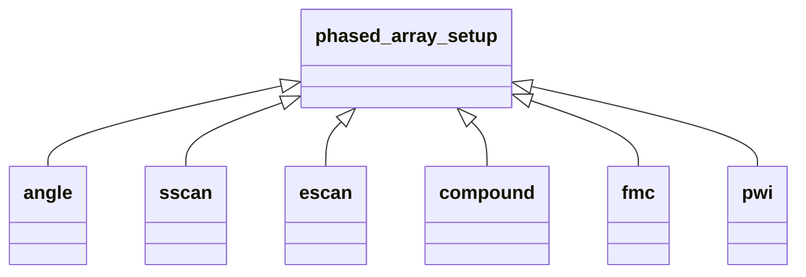
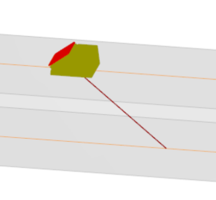
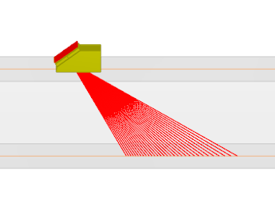
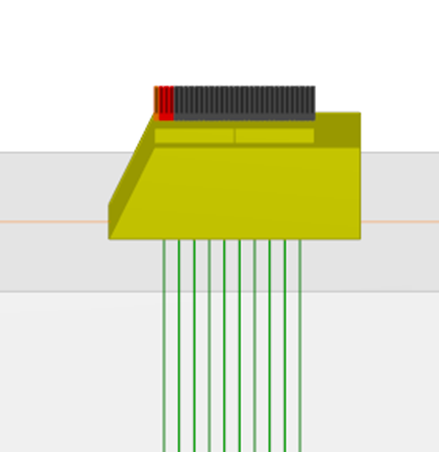
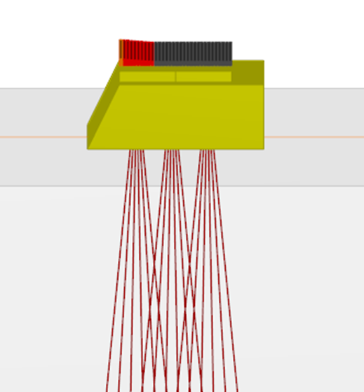

### Phased Array Setup

**Type of inspection**

This optional group has no vocation to be exhaustive in terms of electronic configurations (unlike the law block that
permits any description and is fully generic). However, it is intended to cover most of the situations that are common
in industrial controls and represent a large share of the acquisition files produced in the industry. In this version of
the specification, it encompasses only the most basic setups. The SEQUENCE_TYPE field describes the sequence with the
following choice : ANGLE, SSCAN, ESCAN, COMPOUND, FMC, PWI, CUSTOM. The propagation mode used for the settings is given
in SEQUENCE_ANGLE_MODE.

**Angle**

In this configuration (see Figure 24), a single angle is provided for the specification of the ultrasonic ray direction.

*Figure 24: Inspection using a single angle*

**SScan**

In this configuration (see Figure 25), the probe is configured to emit/receive at a set of angles. The angles are
linearly varying, therefore the first and last angles and the number of shots define the set of angles.

*Figure 25: SScan configuration*

**EScan**

In this configuration consecutive subsets of elements are used in order to form a beam at a specific angle, thus forming
a sweeping set of ultrasonic beams. Figure 26 illustrates an Escan for 4 consecutive elements with a step of 3 elements
on a 32 element linear transducer.

*Figure 26: EScan configuration*

**Compound**

The compound type mixes Escan and Sscan behavior (see Figure 27). COMPOUND_INITIAL_ANGLE, COMPOUND_FINAL_ANGLE and
COMPOUND_NUMBER_OF_ANGLES give the angle scope, while COMPOUND_NUMBER_OF_ELEMENTS gives the number of elements in the
electronic scanning.

*Figure 27: Compound configuration*

## Limitations

This block has no vocation to be exhaustive in terms of electronic configurations (unlike the law block that permits any
description and is fully generic). However, it is intended to cover most of the situations that are common in industrial
controls and represent a large share of the acquisition files produced in the industry.
