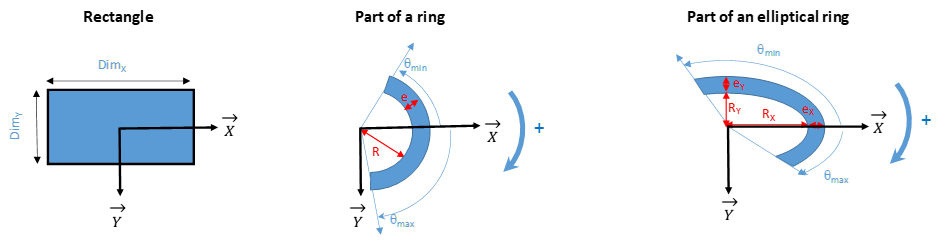
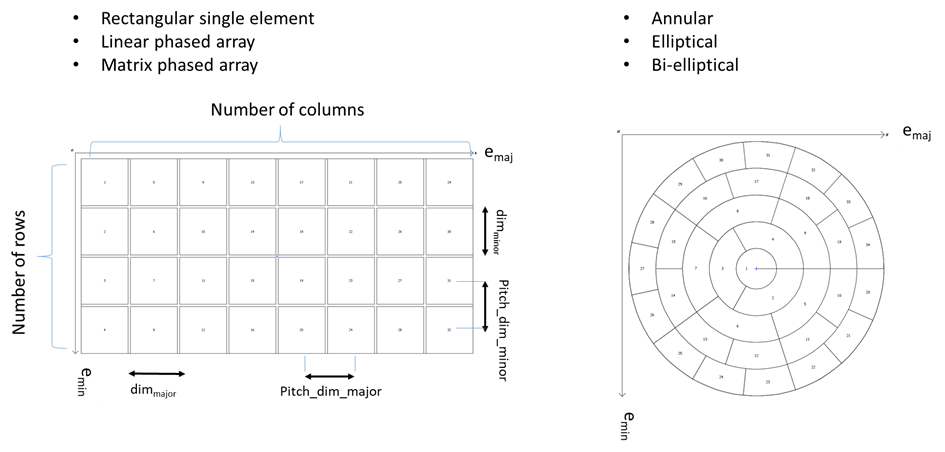
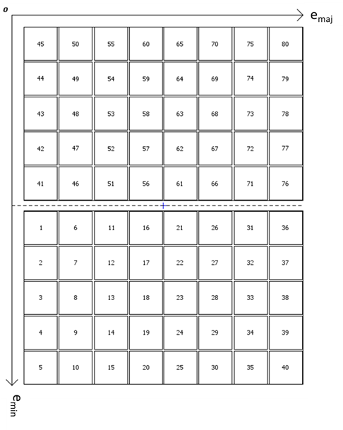
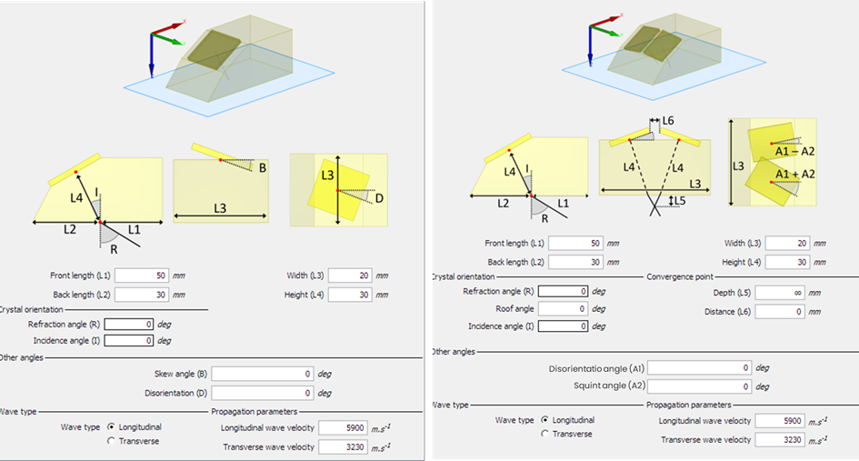
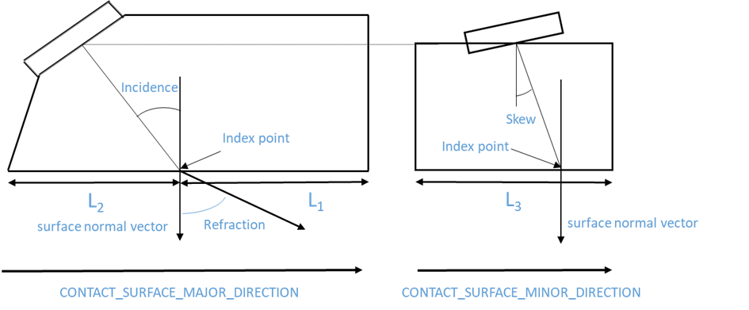
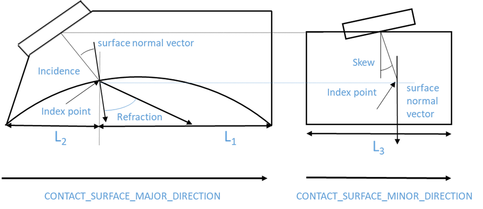
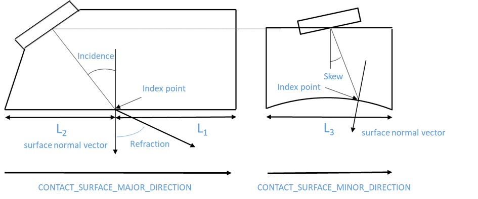
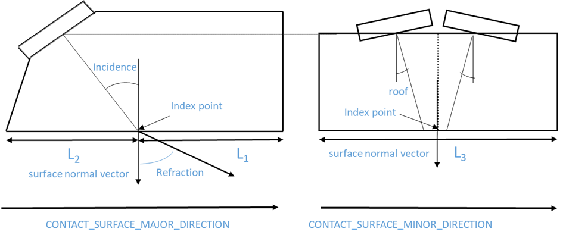
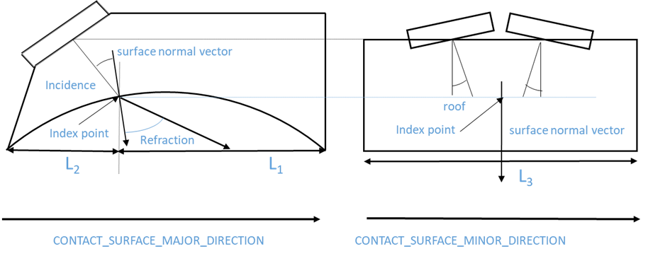
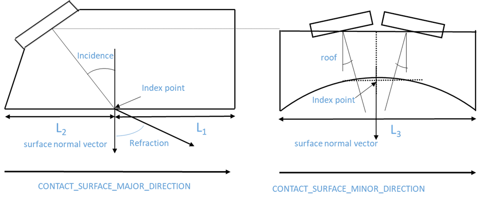

### Probes

**Probe representation**

The probe block of the data model accommodates two distinct levels of representation: a very generic one that describes
the exact positions and shapes of the elements forming the transducer and another one that more closely follows ordinary
technical specifications of the transducer in terms of transducer dimension, pitch, shape, wedge dimensions, etc...

As indicated in the preamble, as for other matters, we have imposed the generic representations and provide optionally
the possibility to have a more NDE-oriented description.

**Dual probes**

In the file format, when using the NDE-oriented description, dual probes are handled as one PROBE block. When using only
the generic description, the freedom to define one or two blocks remains, as in MFMC and ECUF formats.

**Frequencies**

In order to accommodate for advanced setups, we have chosen to give the possibility to define one frequency per element.
A common usage will however be to have one frequency for all elements, and in this case, it is possible to define an
array of size one with the frequency applied to all elements. The same possibility to provide one value applied to all
elements is also provided for other fields related to elements except ELEMENT_POSITION. The cardinality can thus either
be 1 or N.

**Element shapes**

The geometry of the elements is defined by the ELEMENT_SHAPE field. The shape of each element will be defined as one of
the following: rectangle (ELE_GEOM_REC), part of a ring (ELE_GEOM_RING_PART), part of an elliptical ring
(ELE_GEOM_ELLIPSE_PART).

The size is provided through 6 parameters in ELEMENT_SIZE. These 6 parameters indicate the dimensions of each element
according to their geometry, see Figure 12.

For ELE_GEOM_REC : DIM_X1, DIM_Y, 0.0, 0.0, 0.0, 0.0.

For ELE_GEOM_RING_PART: r, e, theta_min, theta_max, 0.0, 0.0

For ELE_GEOM_ELLIPSE_PART: r_X, e_X, r_Y, e_Y, theta_min, theta_max

*Figure 12: Different types of element shape*

**Element positioning**

The ELEMENT_FRAME array defines the position and orientation of the probe elements defined by their frames in the PCF.
For rectangular elements, x and y must be aligned with the main axes of the rectangle. For elliptical elements, x and y
must be aligned with the major and the minor axes of the ellipse. For circular rings, x and y simply must be coplanar
with the element. The frame should be orientated such that z is in the direction of ultrasonic emission (See ).

**Element ordering convention**

For linear and matrix probes (see Figure 13), the chosen convention is as follows : numbering according to the minor
axis then according to the major axis, both in ascending order.

For annular, elliptical and bi-elliptical probes (see Figure 13), the chosen convention is as follows : numbering from
internal rings to external rings. On each ring, the numbering is done in ascending order in the direct direction around
the Z axis of the probe, the origin being taken on the major axis.

For dual probes (see Figure 14), the two probes have a symmetrical cutout. The right probe has elements from 1 to N
following the numbering convention established previously. The left probe has elements from N+1 to 2N with a numbering
symmetrical to that of the right probe according to the major axis.

*Figure 13: Convention for element numbering*

*Figure 14: Convention for dual probes element numbering*

**Wedge angles conventions**

For contact probes, wedge angles are defined according to this order of application (see Figure 15):

1. rotation of the incidence angle around the Y axis of the probe in the direct direction

2. rotation of the skew angle around the new X axis of the probe in the direct direction

3. rotation of the disorientation angle around the new Z axis in the direct direction

For dual probes, wedge angles are defined according to this order of application (see Figure 15):

1. rotation of the incidence angle around the Y axis of each probe in the direct direction

2. rotation of the roof angle around the new X axis of each probe in the direct direction

3. rotation of the disorientation angle around the new Z axis of each probe in the direct direction

4. rotation of the squint angle around the new Z axis of each probe
    - in the direct direction for the right probe
    - in the indirect direction for the left probe.

*Figure 15: Definition of wedge parameters for contact and dual probes*

The definition of the index point for contact probes with planar and cylindrical wedges along the major and minor axis
are given in Figure 16, Figure 17, Figure 18 respectively.

*Figure 16: Definition of wedge parameters for contact planar probe*

*Figure 17: Definition of wedge parameters for CYLINDRICAL_MAJOR contact probe*

*Figure 18: Definition of wedge parameters for CYLINDRICAL_MINOR contact probe*

The definition of the index point for dual probes with planar and cylindrical wedges along the major and minor axis are
given in Figure 19, Figure 20 and Figure 21 respectively.

*Figure 19: Definition of wedge parameters for a dual planar probe*

*Figure 20: Definition of wedge parameters for CYLINDRICAL_MAJOR dual probe*

*Figure 21: Definition of wedge parameters for CYLINDRICAL_MINOR dual probe*

**Surrounded and surrounding probes**

These can be defined by using the cylindrical FOCALISATION_SURFACE. A positive radius will be used for surrounding
probes, a negative one for surrounded probes.

**Velocities**

As for specimens, if both velocities (Longitudinal and shear) are not available, the missing one should be replaced by a
NaN).
