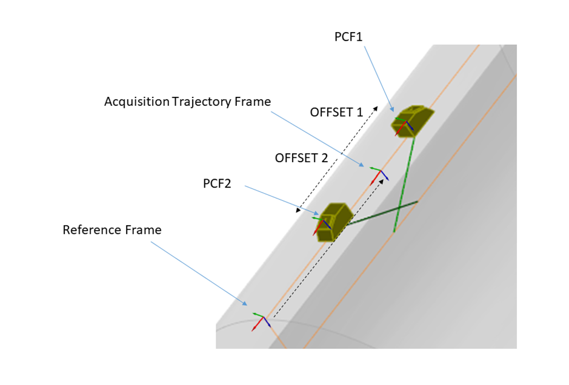

### Ultrasonic setup

**Acquisition gate**

The acquisition gate is implicitly defined by:

- the value of Ascan_Astart
- the sampling frequency
- the dimension of data N_Time\<m\>

t0 : ASCAN_ASTART

tend : ASCAN_ASTART + (N_Time\<m\> - 1)/ASCAN_SAMPLE_RATE

**Gain**

GAIN indicates the total gain for each A-scan during reception. It is a multiplying factor that was applied at
acquisition.

**TCG curves**. The curve is specified in the TCG_CURVE field. It is provided for the entire acquisition gate. The
amplification must be cumulated to the global one defined by the GAIN attribute.

**Laws**

Each A-scan in a dataframe must be associated with both a transmit and a receive focal law through the RECEIVE_LAW and
TRANSMIT_LAW datafields. These contain HDF5 references to the groups which provide the detailed description of each
focal laws (the same structure is used for both transmit and receive focal laws). PRF indicates the pulse repetition
frequency for each Tx/Rx combination

**Dynamic laws**

In order to allow advanced setups with different laws defined for each acquisition position, the cardinality of the
transmission and reception can be either a 1D-array (same laws applied for each dataframe) or 2D (differentiated laws).

**Filter Parameters**

The filtering parameters take different values following the filter type.

- For FILTER_TYPE HIGH_PASS or LOW_PASS this is a single value giving the -3 dB cut-off frequency
- For FILTER_TYPE BAND_PASS this should contain two values for the lower and upper -3 dB cut-off frequencies
- For FILTER_TYPE OTHER, this should be an \[3,N_DF\<m\>\] matrix where the first row is frequency and the second and
  third rows provide the real and imaginary parts of the filter's transfer function at that frequency.

**Combination between offsets and trajectories**

The offsets and directions provided in the dataset blocks can be combined to the data of the trajectory block in order
to share common trajectories between different probes (as is common in TOFD controls for example). In this case, the
trajectories links point to the same trajectory objects and the offsets/rotation between the trajectory and the probe
PCF describe the relative positions of the different probes with respect to the trajectory frame. A typical example is
illustrated in Figure 23, with a trajectory frame given at the Probe Center Separation and offsets used to define the
PCF locations. If the offset is not provided, the PCF and trajectory frame are assumed to be the same.

*Figure 23: Example of offset and trajectory combination in the case of a TOFD inspection*

**Variable gates**

Variable gates are not handled in this version -- it can be emulated by zero---padding the data block