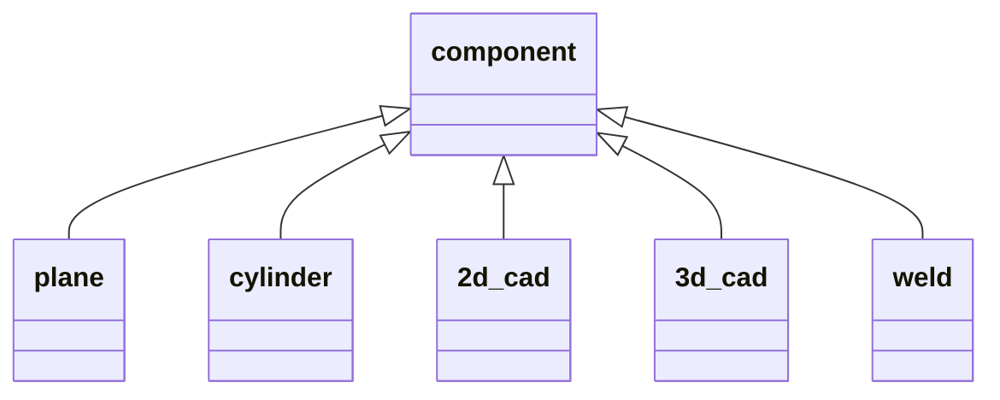
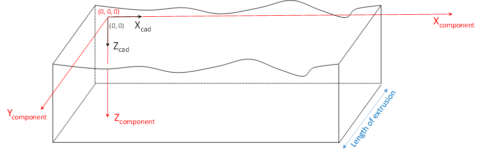
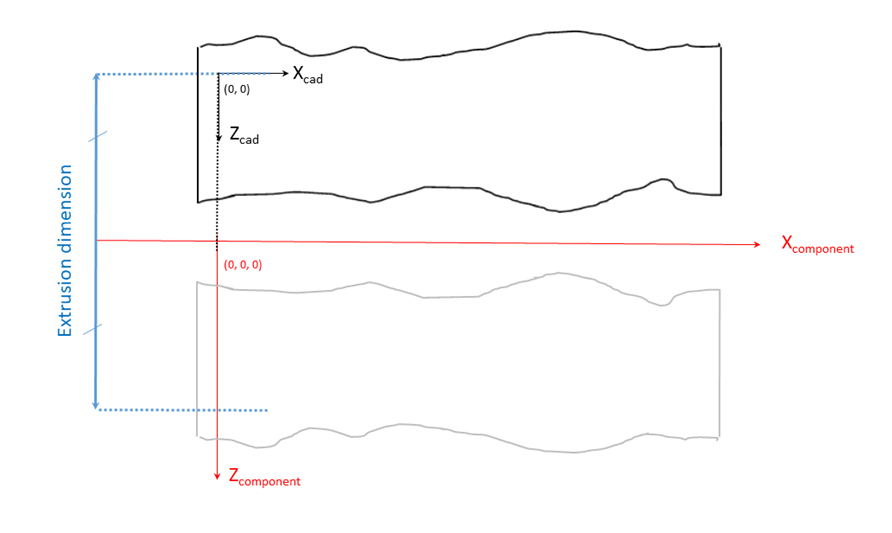

### Component

**Velocities**

The two values of the VELOCITIES array indicate the inspected component longitudinal and shear wave velocity
respectively. If both velocities (Longitudinal and Shear) are not available, the missing one should be replaced by a
NaN).

This version of the format handles only isotropic materials.

**Shape and dimensions**

The geometric shape of the inspected component is defined by the subclass of ONDE_COMPONENT. It can be 
 one of the following: "ONDE_PLANE","ONDE_CYLINDER",
"ONDE_2DCAD", "ONDE_3DCAD", "ONDE_WELD". While the format is quite generic by handling CAD files, parametric description is 
available for plane, cylindrical and weld specimens. Other parameterized shapes can be added in future versions.

For plane components, the dimensions are give by PLATE_DIMENSIONS, with a triplet for length, width and height.

For cylindrical components, the dimensions are given by CYLINDER_DIMENSIONS, with a triplet for outer diameter,
thickness, and length.

/* TODO : update with weld descriptions */

For 2D extruded components and welds, extrusion is provided by EXTRUSION_TYPE (plane or sylindrical) and EXTRUSION_DIMENSION for
the length for plane extrusion, the diameter for cylindrical ones.

The CAD field can contain a STEP or STL file for 3D CADs, a dxf file for 2D CADs.

**Visualisation CAD**

VISUALISATION_CAD contains a DXF or STL file for the component visualization. When using a dxf file, the profile will be
extruded linearly or cylindrically according to the component type.

**Transformations**

The global coordinate system is distinct from the specimen coordinate system : for example, 2D and 3D CAD coordinates
are defined in the specimen frame and repositioned in the global coordinate system with the transformation defined in
COMPONENT_FRAME ([see paragraph 1.6](#definition-of-frames)).

**Conventions for planar specimens**

In the planar coordinate system, the z direction is defined as the one corresponding to the thickness of the inspected
specimen (see Figure 6). The dimensions are given by PLATE_DIMENSIONS, as a triplet with values for length, width, and
thickness.

*Figure 6: Trajectory planar coordinate system convention*

**Conventions for cylindrical components**

In the cylindrical coordinate system, the x direction is the one corresponding to the cylinder axis (see Figure 7). The
dimensions are given by CYLINDER_DIMENSIONS, with a triplet for outer diameter, thickness, and length .

*Figure 7: Trajectory cylindrical coordinate system convention*

**Conventions for 2D CAD components**

The dxf file gives, in the (X, Z) frame, the 2D CAD description of the component, either for a planar or a cylindrical
extrusion. For 2D extruded components, extrusion is provided by EXTRUSION_TYPE (plane or sylindrical) and
EXTRUSION_DIMENSION for the length for plane extrusion, the diameter for cylindrical ones.

The CAD field contains a dxf file for 2D CADs.

For 2D CAD specimen with planar extrusion, the origin is implicitly defined as the (0,0) point in the 2D CAD sketch (see
Figure 8).

*Figure 8: Convention for the description of a 2D CAD component with planar extrusion*

For 2D CAD specimen with cylinder extrusion, the rotation is performed along the X axis of the DXF schema and the 3D
origin corresponds to the projection on this axis of the 2D CAD sketch origin (see Figure 9)

*Figure 9: Convention for the description of a 2D CAD component with cylinder extrusion*

**Visualization CAD**

When a dxf is provided for the Visualization CAD, the extrusion of the CAD is implied from the specimen shape : it is of
linear nature if the specimen is a plate or a 2D CAD with linear extrusion, it is cylindrical if the specimen is a
cylinder or a 2D CAD with cylindrical extrusion. A typical use case for this feature is the ability to superimpose a
weld profile to a plate or cylindrical specimen in order to facilitate the interpretation of the indications.

The CAD profiles that are used for visualization are expressed in the (X,Z) plane as specified in the specimen frame.
Figure 10 illustrates the CAD frame positioning to the component frame for a planar component.

*Figure 10: Convention for the positioning of the visualization CAD in a planar component*

Figure 11 illustrates the CAD frame positioning according to the component frame for a cylinder specimen. The outer
diameter corresponds to the distance between the top left hand corner of the dxf profile and the origin of the component
frame.

*Figure 11: Convention for the positioning of the visualization CAD in a cylindrical component*
