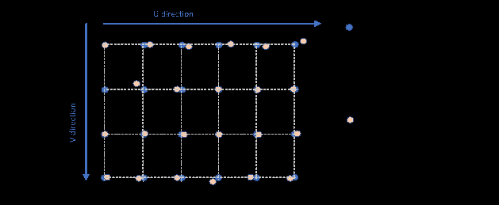

### Acquisition trajectory

**Time encoding**

For acquisition having no spatial encoding, the format allows to describe time encoding. This is achieved by setting the
TRAJECTORY_TYPE field. In the case of time encoding, the ACQUISITION_RATE must be specified.

**Frame used for trajectory definition**

The trajectory is given in the global reference frame.

**Generic description**

A generic description of the trajectory is given in the TRAJECTORY field. It describes successive positions under the
shape of frames, each giving a position and an orientation.

**Grid trajectory**

In order to facilitate the interpretation of trajectories for common cases for which the acquisition grid (1D or 2D) is
defined, the specification allows to complement the generic TRAJECTORY field (which is mandatory) with grid data. The
component must be a plane or a cylinder.

At this stage, the specification does not cover the possibility to describe cylindrical or plane grid trajectories on
CAD specimens, this will be addressed in future versions.

**Grid origin**

The origin and the orientation of the grid (Dx,Dy,alpha) are provided in (x,y) coordinates in the case of a plane specimen, in (x,
theta) coordinates in the case of a cylinder specimen, theta being the radial direction on the unfolded surface. They are expressed as a 2D transform from the surface component
frame in UV_GRID_FRAME. For cylindrical components, it is necessary to specify if the inner or the outer surface is
concerned, which is achieved by setting GRID_CYLINDER_DEFINITION to INNER or OUTER.

This surface component frame is the 2D projection of the component frame on the considered surface (along z for plane
specimens, along r for cylinder specimens).

**Grid positions**

The grid positions which are targeted during the acquisition are given by U_GRID_DATA and V_GRID_DATA : these specify a
cartesian grid. The actual values of the coder at each point of the grid are stored in U_ENCODER and V_ENCODER. For 1D
acquisitions, V_GRID_DATA and V_ENCODER are not to be used.

PROBE_DIRECTION gives the orientation of the probe at each point. It is assumed to be unique for the whole grid.

*Figure 22: Obtained versus specified coder positions*
