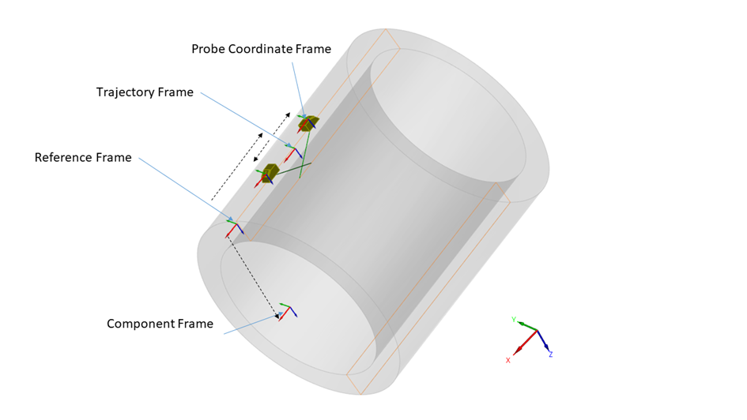
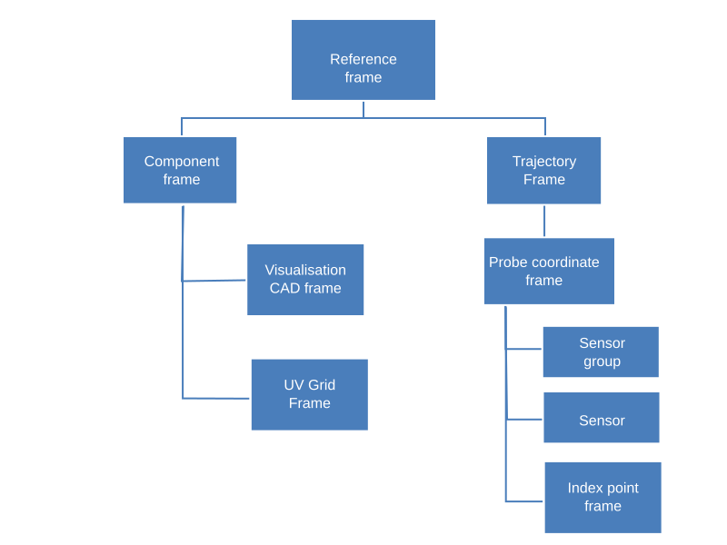
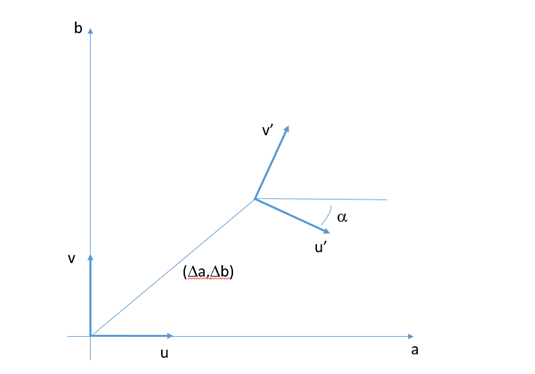

# Open NDE File Format specification - Version 0.9.0

# Generalities

## Preamble

The present document is the outcome of the work of a COFREND Working Group dedicated to NDE and Data. It stems from the observation that no satisfying standardisation exists in terms of file formats for the eddy current NDE technique. This document is therefore a technical proposal to facilitate the establishment of a neutral and open format that can be a good candidate for a wide standardization effort.
The objective that was assigned by the Working Group to this file format is to store eddy current raw data to be able to:
-	(re)analyse it, including eddy current metadata required for report generation, or
-	(re)use it for further data processing.
-	achieve interoperability between acquisition systems and analysis software.

The objective is neither to be able to (re)produce an acquisition setup nor to (re)create a simulation configuration from the eddy current data file alone. We define as raw data the data which is produced by the acquisition system (complex values for each frequency, encoders data for each point, filtering, CSCAN reconstructions). 

For this first version, it was decided to stick to the data acquired and the information that is necessary to perform an analysis. With a few exceptions, we did not add the information that is related to the analysis procedure itself (information related to the display, palette, etc…). This will be addressed in future stages (information related to analysis, reporting, ...). 

The Working Group has analysed several existing contributions as a working basis to define an open and standardized file format for ultrasonic testing. Formats coming from organisations (ECUF, MFMC, DICONDE) and commercial products (EVIDENT, EDDYFI, CIVA) have been studied. 
It was decided that the format would be based on the HDF5 framework, chosen for its well-established software ecosystem and its efficiency. The Eddy current format derives from the ultrasonic file format proposed by the same working group. The ultrasonic proposal makes technical choices akin to those of the MFMC and ECUF formats, and extends their possibilities in order to accommodate for a larger range of specimen geometries and types of data that are commonly encountered and were absent of the MFMC and ECUF specifications.

Discussions in the working group emerged to find the best compromise between two approaches : a very generic one with essentially raw geometric descriptions and a NDT oriented one with a representation of the objects familiar to the engineers. Considering that the transformation from NDT objects to the generic representation was straightforward, it was decided to systematically keep the generic representation and to allow to complement this representation with optional fields describing the objects. This approach was essentially adopted for three objects, namely the probe, the trajectory and the setup of the electronic laws.

From an HDF5 structure perspective, architecture (flat or hierarchical) is not imposed. The nature of the blocks is identified by the TYPE attribute, a VERSION attribute being provided for revisions. Where data from another structure in the file is necessary, its location is given through a HDF5 link. In order to allow the proposed file format to coexist with other hdf5 file formats, the raw data (arrays of signals or array of images which typically represents the vast majority of the file weight) can be anywhere in the file structure. In order to avoid name conflicts issues when the file format will evolve, no other data is allowed within this group. Everything is allowed outside from this group, it will be ignored by reader but can be used for instrument specific data.

SI units are used.

The eddy current values themselves are agnostic in terms of units. All operations on eddy current data are supposing binary unit. Ex : add an offset will be done with offset specified in bits.

Three states are defined: Mandatory, Optional and Implicit (implicit means that value can be derived from other mandatory data). For implicit field, one reasonable rule to make such derivation is given either in the description column or in the notes subsection following each table. 

Data types will be converted to HDF5 classes, the data will be given one of the three states above and be defined as Dataset or Attribute.

## Tables legend

Hereafter, when pointing to ultrasonic HDF5 file format, we refer to specification document xxxx [yyy].

**Variables used in structure definition:**

Definitions 

- ET data point : a demodulated complex number (operating point) obtained at one frequency.
-	Probe
-	Sensor group : collection of sensors (topology) which gives coherent data 
-	Dataset : a collection of coherent data obtained at a particular probe position consisting of at least one of the following:
     - Demodulated data obtained using different emitters and receivers combination for each excitation frequency; 
     - Encoder data and/or temporal data and/or rotation synchronization

As in the UT format, Encoder data (or equivalent) are stored in the trajectory block.
-	CSCAN Sequence – a collection of dataframes in which all acquisition parameters except the probe position are fixed from one dataframe to another;

| **Variable**              | **Description**                                                         |
|---------------------------|-------------------------------------------------------------------------|
| N_Probes                  | Number of probes                                                        |
| N_Dataset                 | Number of datasets                                                      |
| N_SENSOR_GROUP\<p\>       | Number of sensor groups of p-th probe                                   |
| N_SENSOR\<p\>             | Number of sensors in the p-th sensor group                              |
| N_DF\<m\>                 | Number of points in m-th dataset                                        |
| N_Time\<m\>               | Number of time-points per  in m-th dataset                              |
| N_Acquisition_Group\<M\>  | Number of Acquisition group for the m-th                                |
| N_U\<m\>                  | Number of acquisition positions in the U direction for the m-th dataset | 
| N_V\<m\>                  | Number of acquisition positions in the V direction for the m-th dataset |

Note : if N_U and N_V are defined (grid-like acquisition), N_DF\<m\> = N_U\<m\> x N_V\<m\>

## Data Model

The data model of an ONDE file is described through fields that are grouped by blocks, each block corresponding to a NDE
concept.

<!-- AUTO_GENERATED_DATA_MODEL -->

*Figure 1: Relationships between the different blocks in the data model*

The ONDE format introduces an inheritance mechanism in order to specify the attributes that are mandatory and optional for a given group.
The diagram in Figure 1 explains the relationships between the different blocks in the data model in an UML style.

Two blocks type contain the data : namely, CSCAN and RAW blocks. RAW can be used either to describe time dependent signals
or elementary channels data. For Cscan block, it is possible to keep the track to the raw data from which the Cscan data
originates. A link to the setup can be specified : it is attached to the raw data if it is available, to the 
post-processed data (Cscan) otherwise.

The setup description is organized in two blocks defining the eddy current setup and the geometric setup. In the
eddy current setup we find the description of the electronic settings, with blocks describing the reference to an array
of sensors (sensor group).

The geometric setup contains the dynamic description of the scene : inspected component, probes and acquisition
trajectories. It is possible to define different trajectories for different probes or to have probes sharing the same
trajectory, offsets retrieving the set of different probe positions from the trajectory.

## HDF5 implementation

### Relationship between the HDF5 implementation and the data model

The mechanisms used in the ONDE specification to map the data model specification to the HDF5 implementation are 
described above.

### Entry points for navigating files in the UT implementation

The blocks defined in the general structure are implemented as HDF5 groups, the name of which is free but which have a
mandatory 'ONDE:TYPE' attribute that defines their nature. The entry points are the Dataset groups (namely groups that have as a ONDE:TYPE attribute
 ONDE_DATASET_ET_CSCAN or ONDE_DATASET_ET_RAW) 

When discovering the content of a given file, the following procedure must therefore be applied :

- Read the 'ONDE_FILETYPE' and 'ONDE_VERSION' attributes at root level and verify the compatibility of the version number with the
  reader, and that the type is that of a ET ONDE file ('ONDE_ET')
- Read all groups in the file and identify the groups corresponding to the datasets blocks by checking
  which groups have a 'TYPE' attribute whose value is 'ONDE_DATASET_ET_RAW', 'ONDE_DATASET_ET_CSCAN'.
- From there follow the HDF5 references defined in the specification to retrieve the data arrays, the related datasets, the
  setup information, ...

## Definition of frames

### 3D Frames

Figure 2 displays the different frames and convention involved in the positioning systems. The PCF (Probe Coordinate
Frame) is the frame that is related to a specific probe or set of probes. It can be arbitrarily chosen to be centered
along one of the sensor center, the index point, the carrier system etc...
Through a rigid-body offset, it is related to the Trajectory Frame (TF), which for a given position is defined in
relation to the Reference Frame. The list of these positions are defined in an Acquisition Trajectory block.

The components frames are defined in the Reference Frame.

*Figure 2: Different frames and convention involved in the positioning systems*

In the document, it was chosen to define the transformation between two frames in the shape of a vector consisting of 7
values: 3 for the offset in terms of x,y,z directions, 4 for the rotation defining the frame expressed in terms of
quaternions. The definition of rotations through quaternions was chosen because of its compactness and the absence of
ambiguity (as opposed to Euler angles which require defining an ordering of the directions).

The Wikipedia pages related to quaternion and rotation matrices provide formulae for the transition from the quaternion
shape to rotation matrices and the reverse operation: <https://en.wikipedia.org/wiki/Rotation_matrix#Quaternion>.

Throughout the document, a frame is provided for the following objects :

- The specimen frame,
- The trajectory frames (a frame for each position in the trajectory)
- The probe coordinate frames
- The sensors groups
- The index points

The diagram displayed in Figure 3 defines the hierarchy between these frames:

*Figure 3: Hierarchy of the frames used for the geometric representation of the objects*

### 2D Frames

In order to refer to frames on unfolded 2D surfaces, we introduce the following transformation : the transformation
between frame (O,u,v) and (O',u',v') is expressed in the (O,a,b) frame by the (∆a,∆b,α) triplet.

*Figure 4: Definition of the (∆a,∆b,α) triplet defining transformation between two 2D frames*

[^1]: P. Wilcox, MFMC Specification document 2.0.0b.
[^2]: M. Dennis, ECUF Common Ultrasonic Datafile Format, 2018 EPRI Technical Report
[^3]: S. Holland, Data Models for NDE 4.0 and NDE Digital Twin, Chapter for NDE 4.0 textbook

# Appendix A -- conversion from quaternions to matrices

when dealing with 3D orientations, to define the quaternion corresponding to the orientation of one reference frame
relative to another, we need the following formula to calculate the components of a quaternion, q, from the elements of
a rotation matrix, R:

$q_{1} = \ \frac{1}{2}\sqrt{1 + r_{1,1} + r_{2,2} + r_{3,3}}$

$q_{2} = \ \frac{1}{2}sign(r_{3,2} - r_{2,3)}$$\sqrt{1 + r_{1,1} - r_{2,2} - r_{3,3}}$

$q_{3} = \ \frac{1}{2}sign(r_{1,3} - r_{3,1)}$$\sqrt{1 - r_{1,1} + r_{2,2} - r_{3,3}}$

$q_{4} = \ \frac{1}{2}sign(r_{2,1} - r_{1,2)}$$\sqrt{1 - r_{1,1} - r_{2,2} + r_{3,3}}$

Where

$$R\ = \ \begin{pmatrix}
r_{1,1} & r_{1,2} & r_{1,3} \\
r_{2,1} & r_{2,2} & r_{2,3} \\
r_{3,1} & r_{3,2} & r_{3,3}
\end{pmatrix}$$

If q is the unit quaternion corresponding to the rotation matrix R, then -q is the other quaternion corresponding to the
same orientation.

Similarly, if you have a unit quaternion q and want to convert it to a rotation matrix R, the formula is:

$$R\ = \ \begin{pmatrix}
2q_{1}^{2} + 2q_{2}^{2} - 1 & 2q_{2}q_{3} - 2q_{1}q_{4} & 2q_{2}q_{4} + 2q_{1}q_{3} \\
2q_{2}q_{3} + 2q_{1}q_{4} & 2q_{1}^{2} + 2q_{3}^{2} - 1 & 2q_{3}q_{4} - 2q_{1}q_{2} \\
2q_{2}q_{4} - 2q_{1}q_{3} & 2q_{3}q_{4} + 2q_{1}q_{2} & 2q_{1}^{2} + 2q_{4}^{2} - 1
\end{pmatrix}$$

*Source:[Quaternions and Rotation Sequences: A Primer with Applications to Orbits, Aerospace and Virtual Reality](https://amzn.to/2RY2lwI)
by J. B. Kuipers (Chapter 5, Section 5.14 "Quaternions to Matrices", pg. 125)*
